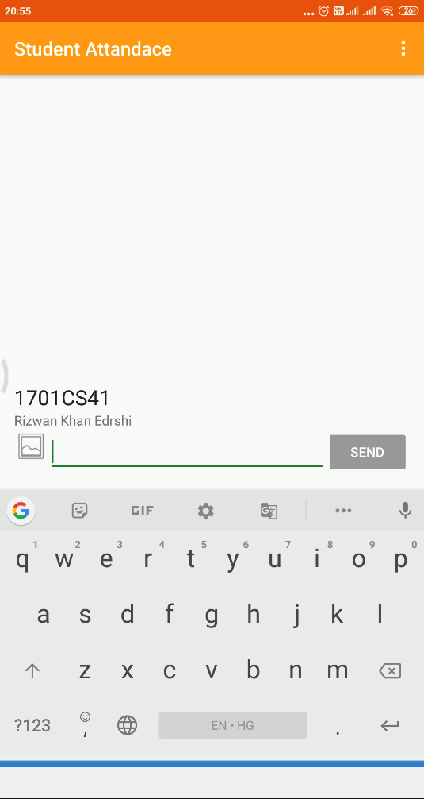
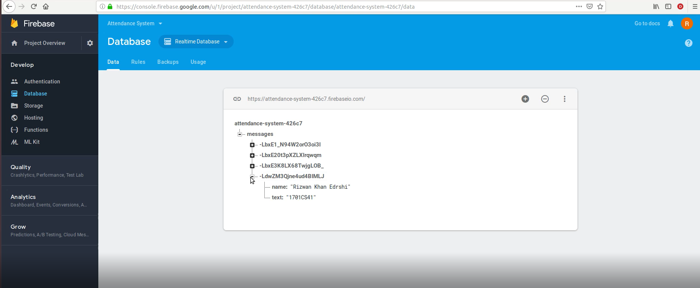
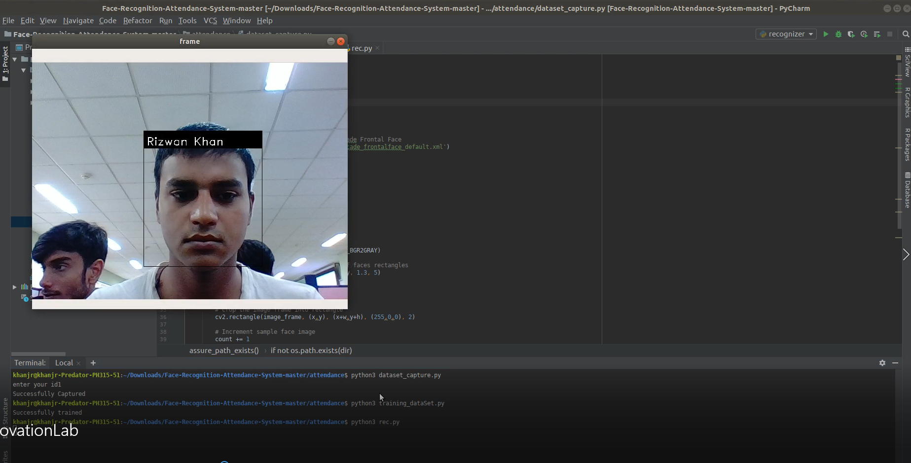
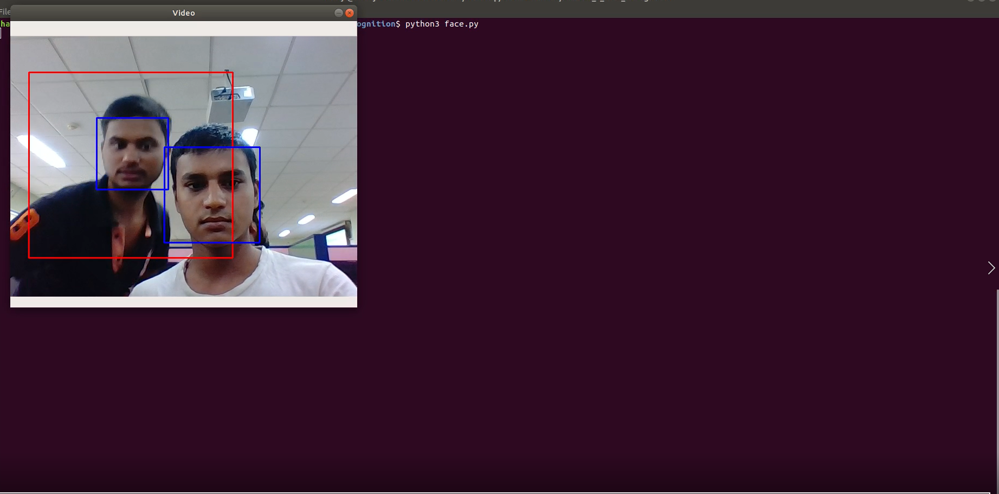
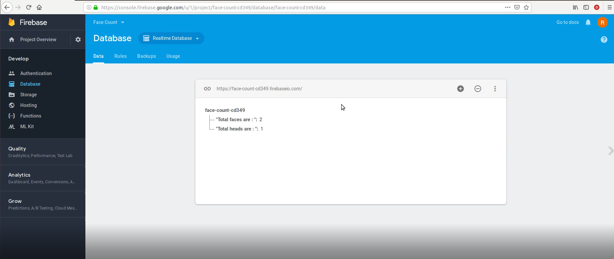

# Attendance-System-Using-OpenCv-and-Firebase
## Breaf Intro.
This is my innovation lab project. Using OpenCv and firebase to face recognition and take attendance.
I had created this project in my Lab Course (Innovation Lab), I have completed this project under **```Dr Jimson Mathew (Mentor) HOD of CSE Department IIT PATNA```**.

In this project i have used **Python, Java, OpenCv, FireBase and Android studio(Create Khan Present App)** more of this i have describe in my Project Report.

So let's get started,

The project started with an **Android App Name KhanPresent** this app is used to take your **Name and RollNo** to the server which in  the place of server i have used **FireBase**. What this does, this give total no. of student in class with there rollno and name.


Next get the face recognition of student to verify the student is actually present in the class.

Now we have the student present in class, what if any student leave the class in the midtime. So, for that i have created a continuously running student detection process that detect the upper body and face of student, that can tell the number of student present in the class and uploaded to the server.

## [Project Report](https://github.com/KhanJr/Attendance-System-Using-OpenCv-and-Firebase/blob/master/Project%20Demo/projectReport.pdf)
In this report I have describe my strategies and how i planed this project to success.
I have completed this project. In next section i am going to give you a little taste of what this project is capable of.
So you can go threw my report and get some refrence from this. after you read my project report, you will be able to understand how i done this project.


## Video Demo
#### There are steps to watch these video because i have not added the code for this project(Kinda private), Please watch these accordingly.

Step I:       Read the [Project Report](https://github.com/KhanJr/Attendance-System-Using-OpenCv-and-Firebase/blob/master/Project%20Demo/projectReport.pdf) (Recommended). 

Step II:      Watch **[KhanPresentApp](https://github.com/KhanJr/Attendance-System-Using-OpenCv-and-Firebase/blob/master/Project%20Demo/KhanPresentApp.mp4)** titled video. Here few things need to notice that this is the Android App that is used to take **RollNo and Name** to the **Server**. 


**Here is the Given Attendence**



Step III:     Watch **[InnovationLab_1](https://github.com/KhanJr/Attendance-System-Using-OpenCv-and-Firebase/blob/master/Project%20Demo/InnovationLab_1.mkv)** titled video. This is the firebase output of the App input. 



Step IV:      Watch **[InnovationLab](https://github.com/KhanJr/Attendance-System-Using-OpenCv-and-Firebase/blob/master/Project%20Demo/InnovationLab.mkv)** titled video. This is the main video demo of this project. I can actually make sub-section in this section.

Step IV(i):   First section of this Video is to find out the face recognition. I have train the model by taking the 30 face photo, in demo video you will find it out.



Step IV(ii):  Second section of this video is to write the values in xml file using face recognition. You will find another name in this sheet this is my friend i was testing this on him.


Step IV(ii):  Third section of this video is to detect total number of student in the class.



**Here is the firebase output**




## Code Of The Project
I haven't uploaded the code for this project because i am continuously developing this project, because according to me this is one of the major need in india, we waste a ton load of paper for this purpose. I don't want our one of the key component of living (tree) to be wasted like that.
